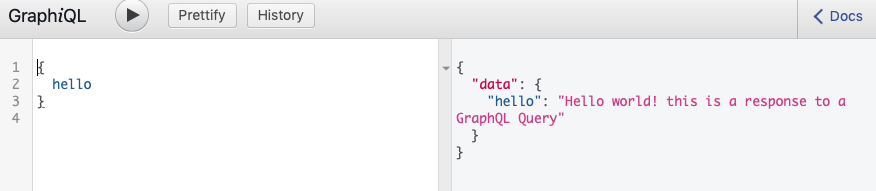

# GraphQL_Demo
This project demonstrates the use of GraphQL for quering data from the server. 

## Installation
Run `npm install` from the root directory.

## Run the App
`node server.js`

## Make changes to the App
Edit the Contents of `server.js` file

## Screenshot
